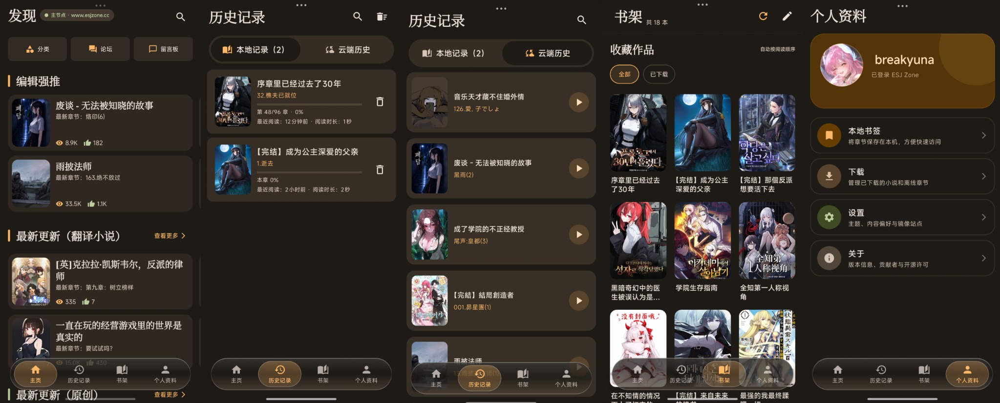

  

<h1 align="center">EsjzoneViewer</h1>

面向 Android 的 ESJ Zone 第三方小说阅读客户端

  
  
  

  <a href="https://github.com/breakyuna/EsjzoneViewer/releases">下载</a> ·
  <a href="#功能">功能</a> ·
  <a href="https://github.com/breakyuna/EsjzoneViewer/issues">反馈问题</a> ·
  <a href="#致谢">致谢</a>

## 📜 项目来源与许可声明

**EsjzoneViewer 是 ESJ Zone 的第三方 Android 应用，并非 ESJ Zone 官方客户端。**

本项目基于 [DeeChael/Esjzone](https://github.com/DeeChael/Esjzone) 继续开发，在原有基础上改进阅读体验、本地书架、下载与社区功能，感谢原作者的贡献。

- **原始项目**：[DeeChael/Esjzone](https://github.com/DeeChael/Esjzone)
- **原作者**：[DeeChael](https://github.com/DeeChael)
- **当前维护者**：[breakyuna](https://github.com/breakyuna)
- **开源许可证**：[GNU General Public License v3.0](LICENSE)

---

## 📋 使用与数据说明

### 🌐 数据来源

小说、封面、章节、评论等内容来自当前选择的 ESJ Zone 站点。应用提供适合 Android 设备的浏览与阅读界面，不代表原站发布内容或作出承诺。

### 🔐 账户与本地数据

- 登录信息会发送到当前选择的站点，应用在本机保存登录会话以恢复登录状态。
- 设置、搜索历史、书架、阅读历史和书签保存在本地；本地阅读历史不上传，云端历史单独展示。
- 云端收藏仅用于补充本地书架，不会因云端缺失而删除本地书籍；主动从书架移除书籍时，应用会尝试取消对应的云端收藏。
- 应用会缓存内容，并保存用户下载的小说章节；请妥善保护设备与应用数据。

### ©️ 内容与使用边界

- 小说、插画、封面及其他站点内容的相关权利归各自权利人所有，本项目不声称拥有这些内容。
- 使用、下载或导出内容时，请遵守原站规则及适用要求，尊重作者与译者的权益。
- 成人内容显示可在设置中调整，请根据年龄与所在地要求使用相关功能。
- 站点结构、登录状态或网络环境变化可能影响在线功能，应用不保证所有页面始终可用。

## 📮 权利声明

若 ESJ Zone（`www.esjzone.cc` / `www.esjzone.one`）运营方或相关权利人认为本应用存在不当行为，可通过 [GitHub Issues](https://github.com/breakyuna/EsjzoneViewer/issues) 联系维护者，说明相关页面与具体问题，以便核实处理。

---

## 📥 下载与使用

**下载渠道：[GitHub Releases](https://github.com/breakyuna/EsjzoneViewer/releases)**

1. 使用 **Android 10（API 29）或更高版本**的设备，下载 Release 中的 APK 并安装。
2. 在登录页或设置页选择可用站点：`www.esjzone.cc` 或 `www.esjzone.one`。
3. 使用 ESJ Zone 账户登录后，浏览小说、管理书架或继续阅读。

> 💡 下载完成的章节可以直接在应用内阅读，无需先导出 TXT 或 EPUB；未下载的内容、远程插图和在线社区功能仍可能需要网络。

## 功能

- 🔍 **浏览与搜索**：查看热门推荐、最新更新和分类，按关键词搜索小说，并管理本地搜索历史。
- 📚 **本地优先书架**：优先显示本地书籍，后台补充云端收藏；支持封面宫格、按最近阅读排序、批量移除与删除确认。
- 📖 **连续阅读**：滚动衔接章节，通过目录和全书进度条定位，支持进度预览与返回原进度。
- 🎨 **阅读自定义**：调整字体大小、行距、段距、页边距和背景，支持简繁体切换与 Catppuccin 主题配色。
- 🕘 **阅读历史**：保存本机阅读位置，同一本书保留最近记录，本地与云端历史分开展示。
- 🔖 **本地书签**：收藏章节位置，方便再次访问。
- 📥 **后台下载**：下载任务可在离开详情页后继续，失败时保留已完成的章节。
- 📄 **文件导出**：将下载内容导出为 TXT 或 EPUB，便于在其他阅读工具中使用。
- 💬 **社区互动**：浏览论坛分区、主题和留言板，查看评论、发表评论及回复。
- 🌐 **站点切换**：支持在登录页或设置页手动切换 `www.esjzone.cc` 与 `www.esjzone.one`；当前站点无法访问时，可尝试另一个站点，实际可用性取决于网络环境与站点状态。
- ⚙️ **账户与偏好**：恢复本地登录会话，调整主题和内容显示选项。

## 📷 界面预览

  

## 🛠️ 技术栈

- **Kotlin**：应用开发语言
- **Jetpack Compose / Material 3**：界面与交互
- **Voyager**：页面与 Tab 导航
- **Room**：本地书架、历史、书签和状态存储
- **OkHttp**：网络请求与会话处理
- **Jsoup / Xsoup**：HTML 与 XPath 解析
- **Coil**：封面、头像和插图加载
- **Gson**：JSON 数据处理
- **Catppuccin**：主题配色

## 🌐 网络接口与页面分析

ESJ Zone 的网络请求、登录认证、页面结构与 HTML 解析相关说明整理在 [`NETWORK/`](NETWORK/) 目录中。

这些文档由 GPT Work 使用云浏览器访问 ESJ Zone 网站，对页面 DOM、表单、内联脚本及可观察的请求行为进行分析后整理而成，属于网站页面与接口的逆向分析记录，并非 ESJ Zone 官方 API 文档。推断或尚未验证的内容已在文档中标注，使用时请注意其验证状态。

## 🐛 反馈与贡献

欢迎通过 [Issues](https://github.com/breakyuna/EsjzoneViewer/issues) 报告问题或提出建议，也欢迎提交 Pull Request。

为了方便定位问题，请尽量提供：

- 应用版本、设备型号和 Android 版本
- 复现步骤、预期表现与实际表现
- 相关页面地址、截图或错误日志

> 🔒 提交截图和日志前，请删除密码、Cookie、会话凭据及其他不希望公开的个人信息。

## 致谢

感谢原作者 [DeeChael](https://github.com/DeeChael) 提供项目基础，感谢所有参与开发、测试和反馈的贡献者。

同时感谢 Jetpack Compose、Material 3、Room、[Voyager](https://github.com/adrielcafe/voyager)、[OkHttp](https://github.com/square/okhttp)、[Coil](https://github.com/coil-kt/coil)、[Gson](https://github.com/google/gson)、[Jsoup](https://github.com/jhy/jsoup)、[Xsoup](https://github.com/code4craft/xsoup) 和 [Catppuccin](https://github.com/catppuccin/catppuccin) 等开源项目。

## 📄 许可证

本项目采用 **GNU General Public License v3.0**，完整文本见 [LICENSE](LICENSE)。保留原项目的版权与许可证信息，第三方依赖遵循各自的许可证。
